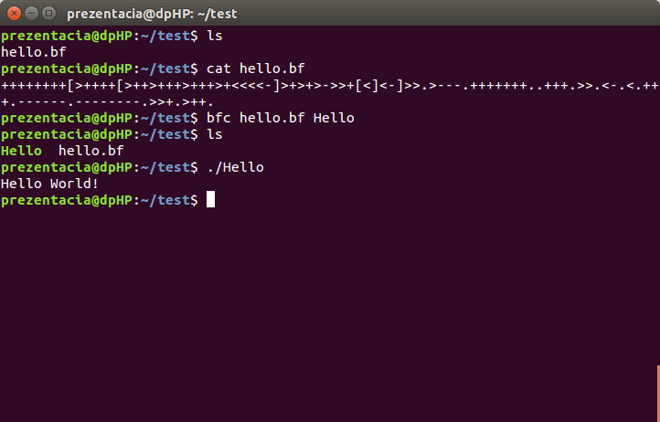

Description
===========
`bfc` is a simple [Brainfuck](https://en.wikipedia.org/wiki/Brainfuck) compiler. Brainfuck is an esoteric programming language.

The source consist of only 3 files. Python script `bfpreproc.py` is used to translate brainfuck instructions (`+-<>[],.`) to macro names defined in `bfcskel.asm`. These two are used by the bash script `bfc`

Dependencies
============
- `python3`
- `nasm` (netwide assebler)

Installation
============
`make install`

Usage
=====
`bfc hello.bf executable`

